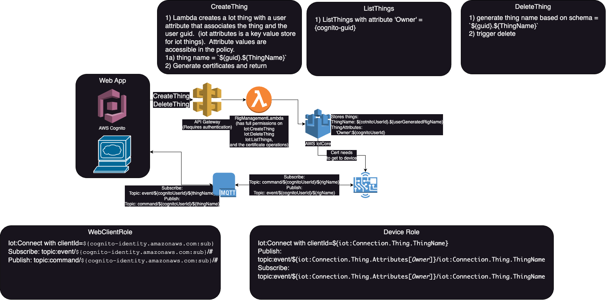

# Auth Poc

## Summary
This is a cdk + kotlin app that that walks through a user and device auth workflow that highlights how cognito and certificate credentials work with AWS IoT MQTT system.  

Consider a SaaS system where you have users and devices (called Rigs in the sample application).  



I had the following requirements:
- User's use cognito credentials to authenticate to the AWS MQTT broker.
- Device's use AWS IoT certificates to authenticate to the AWS MQTT broker.
- One user must be able to send and receive messages from all their devices.
- One user must not send or receive messages from another user or another user's devices.
- One device must be able to send and receive messages from owner, user.
- One device must not send and receive messages to any other devices even if owned by the same user.

## Setup
### 1. Pre-req
Follow the pre-req section of https://cdkworkshop.com/15-prerequisites.html.  
You also need gradle and a JDK.

### 2. Deploy the infrastructure
```
cd infrastructure
cdk deploy
```

### 3. Run the sample
```
cd app
gradlew build 
```
The test task will run `DeviceTest.kt` and `UserActionTest.kt` to test the workflows and MQTT clients based on auth artifacts from Users and Certificates.


## Workflows 
See the code its better.

User Create:
1. User created on user pool
2. Iot policy corresponding to that user created

Username password auth:
1. get identity from IdentityPool that corresponds to this user
2. attach the Iot policy to that user (limits them to only, one client and pub/sub only on topics that are prefixed with their username)
3. create websocket based mqtt client user/session credentials 

Note: we will probably invert 2 and 3, first try to create the websocket then call a lambda that will attach the policy for you if the websocket fails.  

Create certificate:
1. get certificate from Iot
2. create policy on iot for that device
3. attach policy to certificate
4. create thing for that device
5. attach certificate to the thing
6. activate the cert

Note: this will be handled by a lambda behind api gw that enforces authenticiation against our user pool

Cert auth:
1. use cert to create an MQTT client

## Possible improvements / open questions
1. We could possibly use policy variables to reduce the number of policies.  Use `thingName` so each new user causes 2 policies, one user level policy and one device level that allows access on `topic/<username-hardcoded>/{iot:thingName}`.  We could even try storing username in the thing attributes to get this number even lower.  We can explore this to reduce our costs, but unless we see a high volume of device creation / removal I dont know if this will make a substantial impact on cost.  Device registry updates are priced $1.25/million operations [pricing](https://aws.amazon.com/iot-core/pricing/), [api-listing](https://aws.amazon.com/iot-core/pricing/additional-details/#Registry).  We only need to use these constant time per device.
2. How do we handle credential rotation over long sessions?  My sample app doesnt account for this.  I think the more full featured JS sdk should support this, but its not verified yet.

